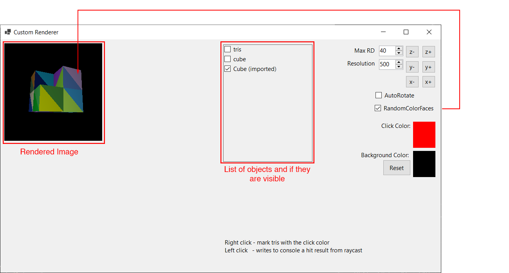

# Custom Renderer

A simple custom rendering engine for drawing objects using triangles on a form. This project serves as a demonstration (mainly for myself) of how to manually render 3D objects by manipulating and rasterizing triangle vertices.

## Installation

1. Clone the repository:
```sh
git clone https://github.com/petrosik/custom-renderer.git
```
2. Open the project in Visual Studio.
3. Build and run the application.

## Usage

- The renderer opens a form's window and starts rendering defined objects if they are visible.
- Modify the `Form1_Load` method to add custom objects or change rendering parameters.
- Triangle data can be hardcoded or loaded dynamically from a `*.obj` file.

Right Click - Raycasts to the scene and colors the intersected tris with the `Click Color`.  
Left CLick  - Raycasts to the scene and returns if any object were intersected (in console).  



`MaxRD` - Sets how far should the camera see  
`Resolution` - The size of the rendered image (ie. 500 == 500px)  
`AutoRotate` - As it suggests it automaticly rotates all objects on all axis  
`RandomColorFaces` - Gives all Faces custom color to render them as  
`Click Color` - Color that the face will get color if it is right clicked  
`Background Color` - The default background color for the world (can be set transparent)  
The buttons nex to MaxRD are for rotating all objects on said axis by 45 angle  

### Example Code

```csharp
// Static collection of all objects to render
public static List<Object> SceneCollection = new List<Object>();

// Example: Defining a simple triangle and adding it to the Scene Collection
SceneCollection.Add(new Object(
    "tris", // Name
    new()  // Creating a list of triangles (List<List<Vector3>>)
    { 
        new() // Defining a single triangle with three vertices
        { 
            new(0, 0, 0),  // Vertex 1
            new(0, 1, 0),  // Vertex 2
            new(0, 0, 1)   // Vertex 3
        }
    }, 
    Color.White, //Color of the object
    new Vector3(0, 0, 0) // Origin
));

// Adjusting the position of the "tris" object to center it on the screen
SceneCollection[0].Position = new Vector3(0, 0.5f, 0.5f);
```

There are lot more methods and properties inside the `Object` and `Camera` classes.

### Things to note
- The rendering method is relatively simple and does not care about face orientation
- Speed of the rendering is linked with size of the image, if you check auto rotate and is rotating slowly decreas the image size and it will rotate faster
- **Do not** try to render complex objects the entire thing is running on a single thread on the cpu so it is not very fast, the complex cube that is included is already near its limit on 500 pixels
- The Camera is positioned at [-2, 0.5f, 0.5f] and is rotated to face to a positive X-axis [1, 0, 0]
- I'm using my NuGet package, which is currently private. If you want to run the project, you'll need to modify any methods that rely on it or wait until I make the `Petrosik.Utility` package public.

## Contributing

This project was intended to be a test demo, so I will not be fixing it if it's not optimal. However, feel free to open an issue ticket if you find anything.

## License

This project is licensed under the MIT License - see the LICENSE file for details.
